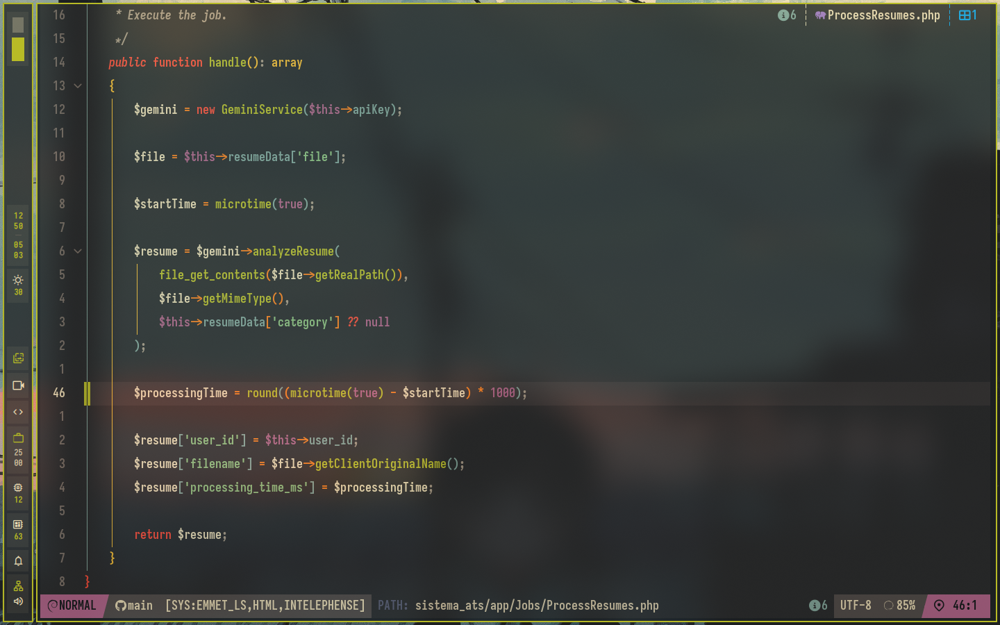

# Neovim Configuration

This repository contains my personal Neovim configuration, designed for an efficient and feature-rich development environment. It leverages `lazy.nvim` for plugin management and integrates with NixOS for a reproducible setup.

## Features

-   **NixOS Integration**: Seamlessly integrates with NixOS for managing dependencies and configuration.
-   **Plugin Management**: Utilizes `lazy.nvim` for fast and asynchronous plugin loading.
-   **Comprehensive Keybindings**: Intuitive keymaps for navigation, editing, LSP, Git, and debugging.
-   **Sensible Defaults**: Configured with a focus on usability and developer experience.
-   **Language Server Protocol (LSP)**: Integrated LSP for intelligent code completion, diagnostics, and refactoring.
-   **Debugging (DAP)**: Configured for debugging with common keybindings for stepping and breakpoints.
-   **Testing (Neotest)**: Support for running and managing tests directly within Neovim.
-   **Fuzzy Finding**: Powered by `Telescope` for quick file, buffer, and content searching.
-   **Git Integration**: Enhanced Git workflow with `Lazygit` and custom keybindings for common Git operations.

## Installation

### NixOS

If you are using NixOS, this configuration is designed to be integrated directly into your system configuration. Refer to the `flake.nix` file for details on how to incorporate it.

### Manual Installation (Non-NixOS)

1.  **Clone the repository**:
    ```bash
    git clone https://github.com/YOUR_USERNAME/YOUR_REPO_NAME.git ~/.config/nvim
    ```
2.  **Install `lazy.nvim`**:
    The configuration will automatically bootstrap `lazy.nvim` on the first launch.
3.  **Install dependencies**:
    Depending on your environment, you may need to manually install language servers, formatters, and linters. If not using Nix, `mason.nvim` will assist in managing these tools.

## Usage

### Leader Key

The leader key is set to `<Space>`.

### Keybindings

This configuration provides a wide array of keybindings. Here are some of the most frequently used categories:

#### General
-   `<C-a>`: Select all
-   `<C-c>`: Copy to system clipboard
-   `<C-s>`: Save current file
-   `<C-f>`: Search/replace in current buffer
-   `<leader>d`: Delete selection/line to blackhole register
-   `<A-j>`, `<A-k>`: Move selected lines/current line up/down
-   `<C-d>`, `<C-u>`: Scroll half page down/up, keeping cursor centered

#### LSP
-   `gd`: Go to definition
-   `gr`: Go to references
-   `gi`: Go to implementation
-   `K`: Show hover documentation
-   `<leader>rn`: Rename symbol
-   `<leader>ld`: Open float diagnostic
-   `[d`, `]d`: Go to previous/next diagnostic

#### Navigation (Telescope)
-   `<leader>fb`: Fuzzy find buffers
-   `<leader>fg`: Live grep (search content)
-   `<leader>ff`: Find files
-   `<leader>fr`: Recently opened files
-   `<leader>fs`: Grep string under cursor

#### Splits
-   `<leader>sv`: Vertical split
-   `<leader>sh`: Horizontal split
-   `<leader>se`: Equalize window sizes
-   `<leader>sx`: Close current split
-   `<C-h>`, `<C-j>`, `<C-k>`, `<C-l>`: Navigate between splits

#### Buffers
-   `<Tab>`: Next buffer
-   `<S-Tab>`: Previous buffer
-   `<leader>bd`: Delete current buffer
-   `<C-q>`: Remove buffer
-   `<A-1>` - `<A-9>`: Switch to buffer 1-9

#### Git
-   `<leader>g`: Toggle Lazygit
-   `<leader>gb`: Git blame line
-   `<leader>gd`: Git diff picker
-   `<leader>gh`: Git log file picker
-   `<leader>gs`: Git status picker

#### Debugging (DAP)
-   `<F5>`: Continue/start debugging
-   `<F10>`: Step over
-   `<F11>`: Step into
-   `<F12>`: Step out
-   `<leader>db`: Toggle breakpoint
-   `<leader>dB`: Set conditional breakpoint
-   `<leader>du`: Toggle DAP UI

#### Testing (Neotest)
-   `<leader>tn`: Run nearest test
-   `<leader>ts`: Toggle Neotest summary
-   `<leader>td`: Debug nearest test

## Plugins

This configuration uses `lazy.nvim` to manage its plugins. The plugins are imported from the `lua/plugins` directory.

## Screenshot



---

Enjoy your powerful Neovim setup!
