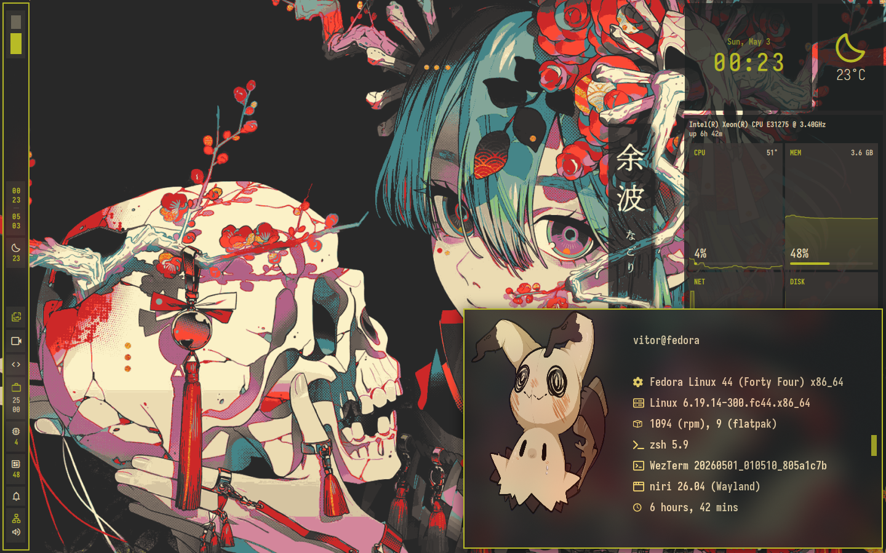

# My Dotfiles

A collection of my personal configuration files for various tools and systems.

## Preview

<!-- Add your main preview image here, e.g.,  -->

## Overview
This repository contains my personal dotfiles, primarily configured for a Fedora/DNF-based system. These configurations aim to create a personalized and efficient development environment.

## Features
*   **Window Manager**: Niri - A scrollable tiling window manager for an efficient workflow.
*   **Shell**: ZSH with Oh-My-Zsh for an enhanced command-line experience.
*   **Terminal**: Wezterm, a GPU-accelerated terminal emulator.
*   **Panel**: Noctalia, a customizable shell panel.
*   **File Manager**: Yazi, a modern, feature-rich terminal file manager.

*   **Text Editor**: Neovim for fast and powerful text editing.

## Keybinds
> **Note**: `$mainMod` is set to the SUPER key (usually the Windows key).

| Shortcut          | Description                                   |
| ----------------- | --------------------------------------------- |
| `$mainMod + Return` | Opens the terminal (Wezterm)                  |
| `$mainMod + Q`      | Closes the active window                      |
| `$mainMod + E`      | Opens the file manager (Yazi)                 |
| `$mainMod + T`      | Toggles the window between floating and tiled |
| `$mainMod + A`      | Opens the launcher/menu (Noctalia)            |
| `$mainMod + P`      | Runs the custom power menu (Noctalia)         |
| `$mainMod + B`      | Opens the default browser (Brave)             |
| `$mainMod + C`      | Opens the default editor (Neovim)             |
| `$mainMod + V`      | Manages clipboard (Noctalia)                  |

## Requirements

- Git
- DNF (for package management on Fedora-based systems)
- Curl (for downloading various tools)

## Quick Start

### Fedora/DNF Setup

To set up your system using the provided scripts:

```bash
git clone https://github.com/viitorags/dotfiles.git
cd dotfiles
./Scripts/install.sh
```


## Scripts
This repository includes a `Scripts/` directory with utility scripts to help manage the setup:

*   `install.sh`: A comprehensive script for installing various tools and configurations, including Neovim, PrismLauncher, Vesktop, Brave, Rust tools, Oh-My-Zsh, DNF packages, Flatpak applications, and dotfiles. It also enables COPRs and sets up Docker and DMS Greeter.
*   `update_config.sh`: Copies configuration files from your `~/.config` directory back into the `~/dotfiles/Config` directory, based on `Scripts/Lists/list_config.txt`, to help synchronize changes.
